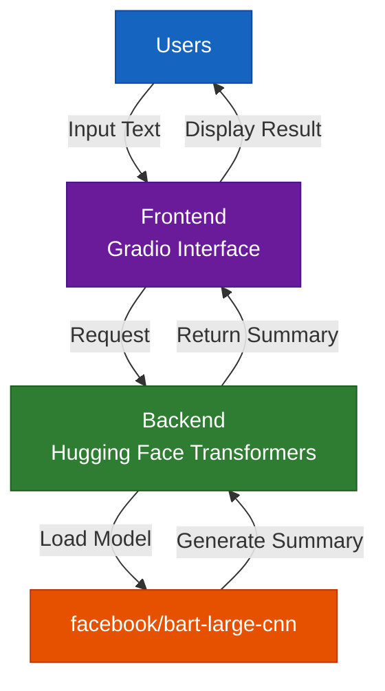

# Text Summarization

A web application for summarizing long texts using the BART Large CNN model. Built with Hugging Face Transformers and Gradio, and deployed on Hugging Face Spaces.

## Live Demo

[Try it here](https://huggingface.co/spaces/amnabarzan/text_summarization)

## Architecture

